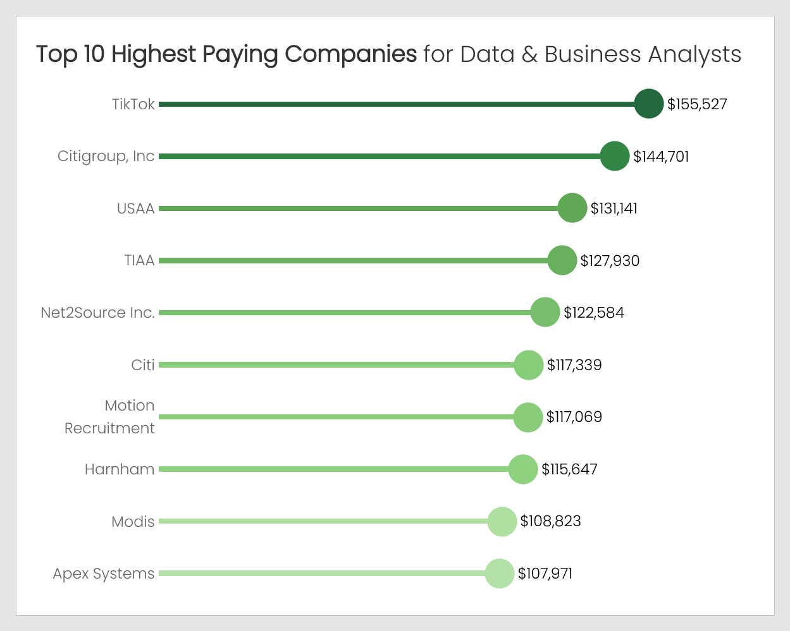

# Data Analytics Job Market Analysis

## Introduction

Explore the data job market! This project dives into job postings within the data analytics field, examining top-paying positions, in-demand skills, and the overlap of high demand with high salaries in data analytics roles.

Check out my queries for this project here: [project_sql folder](/project_sql/)

## Background

This project aims to provide insights into the data analyst job market, documenting exploratory data analysis (EDA) findings and answering key questions about top-paying roles, required skills, and market trends.

Data for this analysis was sourced from Luke Barousse's [SQL Course](https://lukebarousse.com/sql).

Key questions addressed by this analysis include:
1. What are the top-paying data & business analyst positions?
2. What skills are required for these top-paying jobs?
3. Which skill types should prospective Data & Business Analysts focus on?
4. What skills are most in demand for data & business analysts?
5. Which skills correlate with higher salaries?
6. What are the most strategic skills to learn?
7. What are the leading companies offering top-paying roles for data & business analysts?
8. Which cities present the most favorable job market for data & business analysts?

## Tools Used

To conduct this analysis, the following tools were utilized:
- **PostgreSQL**: Used for querying the database and extracting insights.
- **Tableau**: Employed for effective data visualization.
- **Visual Studio Code**: My preferred code editor for querying and integration with GitHub.
## The Analysis

### 1. Premium Data & Business Analyst Positions

Identifying the highest-paying roles involved filtering data & business analyst positions based on average yearly salary and location.

```sql
SELECT
    job_id,
    company_id,
    job_title,
    job_location,
    job_schedule_type,
    job_posted_date,
    salary_hour_avg,
    salary_year_avg,
    ROUND(COALESCE(salary_year_avg, salary_hour_avg * 2080)) new_salary
FROM
    job_postings_fact
WHERE
    job_title_short IN ('Data Analyst', 'Business Analyst')
    AND ROUND(COALESCE(salary_year_avg, salary_hour_avg * 2080)) IS NOT NULL
ORDER BY
    new_salary DESC
LIMIT 10
;
```
#### My takeaways from this query:
- **Salary Range**: The salaries for these positions range from $375,000 to $813,280 per year. This indicates that these roles are
highly compensated, likely due to the specialized skills, experience, and responsibilities associated with them.

- **Job Locations**: The job locations vary across different cities, including New York, Sunnyvale, Los Angeles, San Mateo,
San Francisco, Bethesda, and Austin. This suggests that high-paying opportunities for Data and Business Analysts are
available in various regions across the United States with most of these regions having a high cost of living.

- **Industry and Company Diversity**: The positions span across different industries and companies, including tech companies,
consulting firms, and healthcare organizations. This diversity reflects the wide range of industries that require skilled
Data and Business Analysts and the opportunities available across various sectors.


### 2. Essential Skills for Premium Roles

This section explores the competencies required for top-paying data & business analyst jobs by correlating job postings with skills data.

```sql
WITH top_paying_jobs AS(
    SELECT
        job_id,
        company_id,
        job_title,
        ROUND(COALESCE(salary_year_avg, salary_hour_avg * 2080)) new_salary
    FROM
        job_postings_fact
    WHERE
        job_title_short IN ('Data Analyst', 'Business Analyst')
        AND ROUND(COALESCE(salary_year_avg, salary_hour_avg * 2080)) IS NOT NULL
    ORDER BY
        new_salary DESC
    LIMIT 10
)
SELECT
    tp.job_id,
    c.name company_name,
    job_title,
    new_salary,
    skills,
    type
FROM
    top_paying_jobs tp
JOIN
    skills_job_dim sj
ON
    tp.job_id = sj.job_id
JOIN
    skills_dim s
ON
    sj.skill_id = s.skill_id
JOIN
    company_dim c
ON
    tp.company_id = c.company_id
;
```

#### My takeaways from this query:

- **Programming Languages**: SQL, Python, R, and VBA are among the top skills
demanded in these high-paying positions. Proficiency in programming languages
is crucial for performing data analysis, developing analytical solutions,
and automating processes.

- **Data Analysis Tools**: Tableau, Looker, and Power BI are also prominent skills.
These tools are essential for creating data visualizations and dashboards,
enabling stakeholders to gain insights from data effectively.

- **Cloud Technologies**: Skills like Databricks, BigQuery, and Snowflake indicate
a growing demand for expertise in cloud-based data platforms. Companies are
increasingly leveraging cloud technologies for data storage, processing,
and analytics.

- **Libraries and Frameworks**: Libraries such as Spark, Airflow, and Hadoop are
also in demand, reflecting the need for skills in data processing, workflow
management, and distributed computing.


### 3. How Do Data & Business Analysts’ Skillsets Differ From Other Data Jobs

A comparison of the broader skill types found in job postings is given in this section.

```sql
--Skill Count and Skill Share for data & business analysts

SELECT
    skill_count,
    type,
    ROUND(skill_count / job_cnt * 100,2)AS skill_share
FROM (
    SELECT
        COUNT(*)::NUMERIC skill_count,
        type,
        (
        SELECT
            COUNT(sj.job_id)::NUMERIC
        FROM
            skills_job_dim sj
        JOIN
            job_postings_fact jp
        ON
            sj.job_id = jp.job_id
        WHERE
            job_title_short IN ('Data Analyst', 'Business Analyst')
        ) job_cnt
    FROM
        job_postings_fact jp
    JOIN
        skills_job_dim sj
    ON
        jp.job_id = sj.job_id
    JOIN
        skills_dim s
    ON
        sj.skill_id = s.skill_id
    WHERE
        job_title_short IN ('Data Analyst', 'Business Analyst')
    GROUP BY
        type
    ) types
ORDER BY
    skill_count DESC
;

--Skill Count and Skill Share for all jobs

SELECT
    skill_count,
    type,
    ROUND(skill_count / job_cnt * 100,2)AS skill_share
FROM (
    SELECT
        COUNT(*)::NUMERIC skill_count,
        type,
        (
        SELECT
            COUNT(job_id)::NUMERIC
        FROM
            skills_job_dim
        ) job_cnt
    FROM
        job_postings_fact jp
    JOIN
        skills_job_dim sj
    ON
        jp.job_id = sj.job_id
    JOIN
        skills_dim s
    ON
        sj.skill_id = s.skill_id
    GROUP BY
        type
    ) types
ORDER BY
    skill_count DESC
;
```

#### My takeaways from this query:

- **Focus on Analyst Tools and Programming**: For data & business analysts, the most
prevalent skill types are analyst tools (41.56%) and programming (37.34%).
This indicates the importance of proficiency in tools for data analysis
and visualization, as well as programming languages for data manipulation
and scripting.

- **Skill Type Differences**: Analyst tools have a much higher skill share
for data & business analysts(41.56%) compared to all data jobs (17.24%).
Similarly, cloud-related skills have a higher skill share in
all data jobs (15.05%) compared to data & business analysts (7.84%).
This suggests that while cloud and library skills are important across all
data roles, they may be relatively less emphasized in data & business
analyst roles.


### 4. High-Demand Skills for Data & Business Analysts

An analysis of the most frequently requested skills in job postings is provided in this section.

```sql
SELECT
    skills,
    COUNT(sj.job_id) skill_cnt
FROM
    job_postings_fact jp
JOIN
    skills_job_dim sj
ON
    jp.job_id = sj.job_id
JOIN
    skills_dim s
ON
    sj.skill_id = s.skill_id
WHERE
    job_title_short IN ('Data Analyst','Business Analyst')
GROUP BY
    skills
ORDER BY
    skill_cnt DESC
LIMIT 10
;
```

#### My takeaways from this query:

- **Foundational Skills**: SQL, Excel, and Python are the top three in-demand skills,
indicating their importance as foundational skills for data and business analysis
roles. Proficiency in these tools is essential for performing data manipulation,
analysis, and visualization tasks.

- **Visualization Tools**: Tableau and Power BI rank among the top skills, highlighting
the increasing demand for professionals who can create compelling data visualizations.
This trend reflects the growing importance of data storytelling and visualization in
conveying insights to stakeholders.

- **Statistical Analysis**: R and SAS, both statistical programming languages, are also
among the top in-demand skills. This suggests that proficiency in statistical analysis
and modeling remains valuable in the field of data and business analysis, particularly
for roles that require advanced analytics capabilities.


### 5. Skills Impacting Salary

This section investigates the average salaries associated with various skills to pinpoint the highest paying competencies.

```sql
SELECT
    skills,
    ROUND(AVG(COALESCE(salary_year_avg, salary_hour_avg * 2080))) avg_salary
FROM
    job_postings_fact jp
JOIN
    skills_job_dim sj
ON
    jp.job_id = sj.job_id
JOIN
    skills_dim s
ON
    sj.skill_id = s.skill_id
WHERE
    ROUND(COALESCE(salary_year_avg, salary_hour_avg * 2080)) IS NOT NULL
    AND job_title_short IN ('Data Analyst', 'Business Analyst')
GROUP BY
    skills
ORDER BY
    avg_salary DESC
LIMIT 10
;
```

#### My takeaways from this query:

- **Emerging Technologies**: The prevalence of skills related to emerging technologies like blockchain (Solidity)
and cloud computing (DigitalOcean) indicates a growing demand for expertise in cutting-edge tools and platforms.

- **Specialized Tools**: Skills in specialized tools such as automated machine learning (DataRobot) and version
control (SVN) highlight the importance of proficiency in niche areas, suggesting a willingness among companies to
pay a premium for specialized skills.

- **Salary Range**: The average salaries for these top paying skills range from approximately $136,000 to $246,586.
This indicates a significant potential for high earning within the data and business analysis field, especially
for those with expertise in niche or in-demand areas.


### 6. Most Strategic Skills for Career Growth

By merging insights from demand and salary data, this section identifies skills that offer both high demand and lucrative salaries, providing a strategic focus for skill development.

```sql
-- Optimal Skills (High Pay & High Demand) for data & business analysts

WITH top_sal AS (
SELECT
    skills,
    ROUND(AVG(COALESCE(salary_year_avg, salary_hour_avg * 2080))) avg_salary,
    COUNT(*) job_post_count
FROM
    job_postings_fact jp
JOIN
    skills_job_dim sj
ON
    jp.job_id = sj.job_id
JOIN
    skills_dim s
ON
    sj.skill_id = s.skill_id
WHERE
    ROUND(COALESCE(salary_year_avg, salary_hour_avg * 2080)) IS NOT NULL
    AND job_title_short IN ('Data Analyst', 'Business Analyst')
GROUP BY
    skills
)
SELECT
    *
FROM
    top_sal
WHERE
    avg_salary > 80000
    AND job_post_count > 1500
ORDER BY
    avg_salary DESC
;

-- Optimal Skills for all jobs

WITH top_sal AS (
SELECT
    skills,
    ROUND(AVG(COALESCE(salary_year_avg, salary_hour_avg * 2080))) avg_salary,
    COUNT(*) job_post_count
FROM
    job_postings_fact jp
JOIN
    skills_job_dim sj
ON
    jp.job_id = sj.job_id
JOIN
    skills_dim s
ON
    sj.skill_id = s.skill_id
WHERE
    ROUND(COALESCE(salary_year_avg, salary_hour_avg * 2080)) IS NOT NULL
GROUP BY
    skills
)
SELECT
    *
FROM
    top_sal
WHERE
    avg_salary > 80000
    AND job_post_count > 3000
ORDER BY
    avg_salary DESC
;
```

#### My takeaways from this query:

- **Python Dominance**: Python stands out as the top skill across both data & business analyst roles and all data jobs
based on its combination of a high average salary and its high demand, indicating its universal importance in the data industry for tasks such as programming and data manipulation.

- **Diverse Skill Set**: While data & business analysts prioritize tools like Tableau and SQL, all data jobs demand a broader range of skills including big data technologies like Spark and cloud platforms like AWS and Azure.

- **Salary Versus Demand**: Specialized skills in big data technologies command higher salaries, but more generalist skills like SQL and Python have greater job demand, suggesting a trade-off between specialization and broader market appeal in terms of job opportunities.


### 7. Top-Paying Companies for Data & Business Analysts

What companies stand out as the top destinations for data and business analysts seeking both professional growth and financial reward?

```sql
SELECT
    c.name company_name,
    COUNT(*) job_post_cnt,
    ROUND(AVG(COALESCE(salary_year_avg, salary_hour_avg * 2080))) avg_salary
FROM
    company_dim c
JOIN
    job_postings_fact jp
ON
    c.company_id = jp.company_id
WHERE
    COALESCE(salary_year_avg, salary_hour_avg * 2080) IS NOT NULL
    AND job_title_short IN ('Data Analyst', 'Business Analyst')
GROUP BY
    company_name
HAVING
    COUNT(*) >= 15
ORDER BY
    avg_salary DESC
LIMIT 10
;
```

#### My takeaways from this query:

- **TikTok Leads in Salary**: TikTok tops the list with the highest average salary for data and business analysts, indicating competitive compensation in the tech industry.

- **Financial Giants**: Companies like Citigroup, USAA, and TIAA are among the top earners, showcasing the lucrative opportunities available in the financial sector for data and business analysts.

- **High-Level Positions Hosted by Recruiting Companies**: The rest of the top 10 is filled out with various roles
hosted by technical recruitings/consulting companies.



### 8. Cities with the Best Job Market for Data & Business Analysts

How do various job locations stack up as top destinations for data and business analysts, offering both lucrative financial rewards and opportunities for professional growth?

```sql
SELECT *
FROM(
    SELECT
        COUNT(*) job_count,
        job_location,
        ROUND(AVG(salary_year_avg)) avg_sal
    FROM
        job_postings_fact
    WHERE
        job_title_short IN ('Data Analyst','Business Analyst') AND
        (
        -- Include rows where the job location contains a city name along with the state
        job_location LIKE '%, VA' -- Virginia
        OR job_location LIKE '%, TX' -- Texas
        OR job_location LIKE '%, FL' -- Florida
        OR job_location LIKE '%, NC' -- North Carolina
        OR job_location LIKE '%, SC' -- South Carolina
        OR job_location LIKE '%, KY' -- Kentucky
        OR job_location LIKE '%, AR' -- Arkansas
        -- Capture abbreviations and variations
        OR job_location LIKE '%NC%' -- North Carolina
        OR job_location LIKE '%SC%' -- South Carolina
        OR job_location LIKE '%VA%' -- Virginia
        OR job_location LIKE '%KY%' -- Kentucky
        OR job_location LIKE '%AR%' -- Arkansas
        OR job_location LIKE '%FL%' -- Florida
        -- Other variations
        OR job_location LIKE '% N. Carolina%'
        OR job_location LIKE '% S. Carolina%'
        OR job_location LIKE '% Virginia%'
        OR job_location LIKE '% KY%'
        OR job_location LIKE '% AR%'
        OR job_location LIKE '% Fla%'
        -- Exclude cases with only state value
        AND (
            job_location NOT LIKE '%Virginia%'
            AND job_location NOT LIKE '%Texas%'
            AND job_location NOT LIKE '%Florida%'
            AND job_location NOT LIKE '%North Carolina%'
            AND job_location NOT LIKE '%South Carolina%'
            AND job_location NOT LIKE '%Kentucky%'
            AND job_location NOT LIKE '%Arkansas%'
            )
        )
        AND salary_year_avg IS NOT NULL
    GROUP BY
        job_location
)
WHERE
    job_count > 9
ORDER BY
    avg_sal DESC
;
```

#### My takeaways from this query:

- **Virginia's Lucrative Markets:** Virginia cities like Vienna, McLean,
and Arlington offer lucrative opportunities for Data and Business Analysts,
with average salaries ranging from approximately $96,035 to $121,438.

- **Texas' Competitive Landscape:** Texas cities such as Plano, Austin, and
Dallas present competitive job markets for analysts, with average salaries
ranging from approximately $91,448 to $106,939, indicative of strong demand
across industries.

- **Florida's Diverse Job Landscape:** Florida provides diverse job
opportunities for analysts, with cities like Jacksonville, Tampa, and Miami
showcasing vibrant markets, despite varying average salaries ranging from
approximately $64,148 to $102,542.

